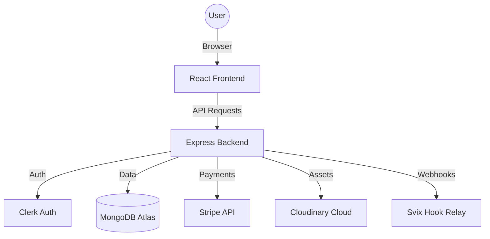

# 🎓 LMS - Advanced Learning Management System

[](https://opensource.org/licenses/MIT)
[](https://reactjs.org/)
[](https://nodejs.org/)
[](https://www.mongodb.com/)
[](https://stripe.com/)

A comprehensive, production-ready Learning Management System (LMS) designed for seamless knowledge sharing. This platform bridges the gap between educators and students with a robust feature set, secure payments, and modern UI.

---

## 🌟 Key Features

### 👨‍🎓 For Students
- **Dynamic Course Discovery**: Search and browse courses with categories and ratings.
- **Interactive Player**: Integrated YouTube player for a seamless learning experience.
- **Progress Tracking**: Visual indicators of course completion and achievements.
- **Secure Enrollment**: One-click purchase via Stripe integration.
- **My Learnings**: A dedicated dashboard for managing all enrolled courses.

### 👩‍🏫 For Educators (The "Educator Portal")
- **Course Studio**: Create rich, multi-media courses with an integrated Quill editor.
- **Analytics Dashboard**: Real-time tracking of student enrollments and revenue.
- **Asset Management**: Automatic media optimization via Cloudinary.
- **Student Insights**: View and manage enrolled students for each course.

---

## 🏗️ System Architecture



---

## 🛠️ Tech Stack

### 💻 Frontend
- **Framework**: React 18 + Vite (for high-speed development)
- **State Management**: React Context API
- **Styling**: Tailwind CSS 4.0 (Modern utility-first CSS)
- **Components**: Clerk UI for Auth, Quill for Rich Text
- **Networking**: Axios / Fetch API

### ⚙️ Backend
- **Environment**: Node.js & Express.js (v5.0 stable)
- **Database**: MongoDB with Mongoose ODM
- **Security**: Clerk Server SDK & Middleware
- **File Handling**: Multer & Cloudinary
- **Automation**: Nodemon for dev-workflow

---

## 📂 Project Structure

```text
LMS/
├── client/              # React Ecosystem
│   ├── src/
│   │   ├── components/  # Atomic & Smart components
│   │   ├── context/     # State persistence
│   │   └── pages/       # Student & Educator views
├── server/              # Node.js Ecosystem
│   ├── configs/         # DB & External service configs
│   ├── controllers/     # Business logic
│   ├── models/          # Data schemas
│   └── routes/          # API routing
└── README.md            # Project Blueprint
```

---

## 📡 API Endpoints (Core)

| Method | Endpoint | Description | Access |
| :--- | :--- | :--- | :--- |
| `GET` | `/api/courses` | List all available courses | Public |
| `POST` | `/api/educator/add-course` | Create a new course | Educator |
| `POST` | `/api/payments/create-checkout` | Initialize Stripe Checkout | Student |
| `GET` | `/api/student/enrolled-courses` | Fetch user's active courses | Student |

---

## 🚀 Rapid Setup

### Prerequisites
- Node.js installed
- API Keys for: **Clerk**, **Stripe**, **Cloudinary**, and **MongoDB Atlas**

### Step-by-Step Installation

1. **Clone & Install**:
   ```bash
   git clone https://github.com/Bhavish511/LMS.git
   cd LMS
   npm run install-all # Custom script if available, or manual npm install in both dirs
   ```

2. **Backend Config**:
   Navigate to `/server` and create `.env`:
   ```env
   MONGODB_URI=...
   CLERK_SECRET_KEY=...
   STRIPE_SECRET_KEY=...
   CLOUDINARY_URL=...
   ```

3. **Frontend Config**:
   Navigate to `/client` and create `.env`:
   ```env
   VITE_CLERK_PUBLISHABLE_KEY=...
   VITE_BACKEND_URL=http://localhost:5000
   ```

4. **Launch**:
   ```bash
   # In /server
   npm run server
   
   # In /client
   npm run dev
   ```

---

## 🤝 Contributing

Contributions are what make the open-source community such an amazing place to learn, inspire, and create. Any contributions you make are **greatly appreciated**.

1. Fork the Project
2. Create your Feature Branch (`git checkout -b feature/AmazingFeature`)
3. Commit your Changes (`git commit -m 'Add some AmazingFeature'`)
4. Push to the Branch (`git checkout origin feature/AmazingFeature`)
5. Open a Pull Request

---

## 📜 License

Distributed under the MIT License. See `LICENSE` for more information.

Built with 💪 by [Bhavish](https://github.com/Bhavish511)
